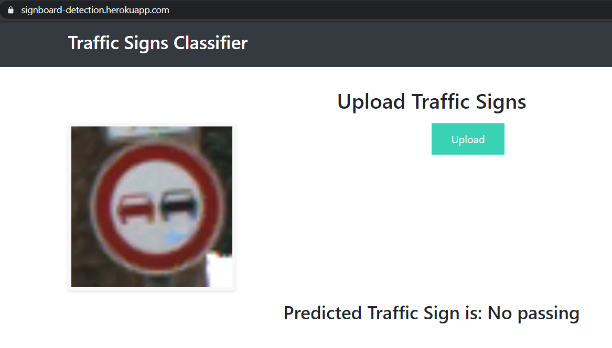

# German-Traffic-Sign-Recognition
## Overview
The project aims at implementing a solution for analyzing the German Traffic Sign Boards and predicting what each sign board means. The project is divided into three steps. 
1. Developing CNN model to classify 43 classes 
2. Flask Integration
3. Deploying application in Heroku

# About Dataset
Dataset has been downloaded from https://www.kaggle.com/meowmeowmeowmeowmeow/gtsrb-german-traffic-sign which has meta data, train and test data, train and test csv files.

# Demo
https://signboard-detection.herokuapp.com/

# Screenshot

